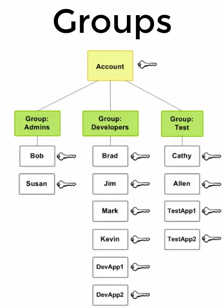
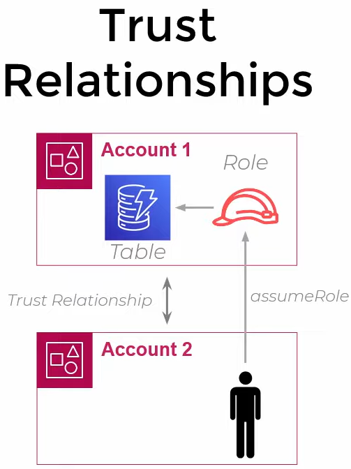

> [AWS IAM Core Concepts](https://www.youtube.com/watch?v=_ZCTvmaPgao)

## IAM core concepts

**IAM**: Identity and Access Management

**Resources**: entities you create in AWS i.e. S3 Bucket

**Actions**: perform actions on resources i.e. S3::CreateBucket

**Policy**: authorization to perform an action

**Groups**: 

**Roles**: both <u>applications</u> and <u>users</u> can assume these roles. Roles have policy documents.

**Trust relationships**: 

